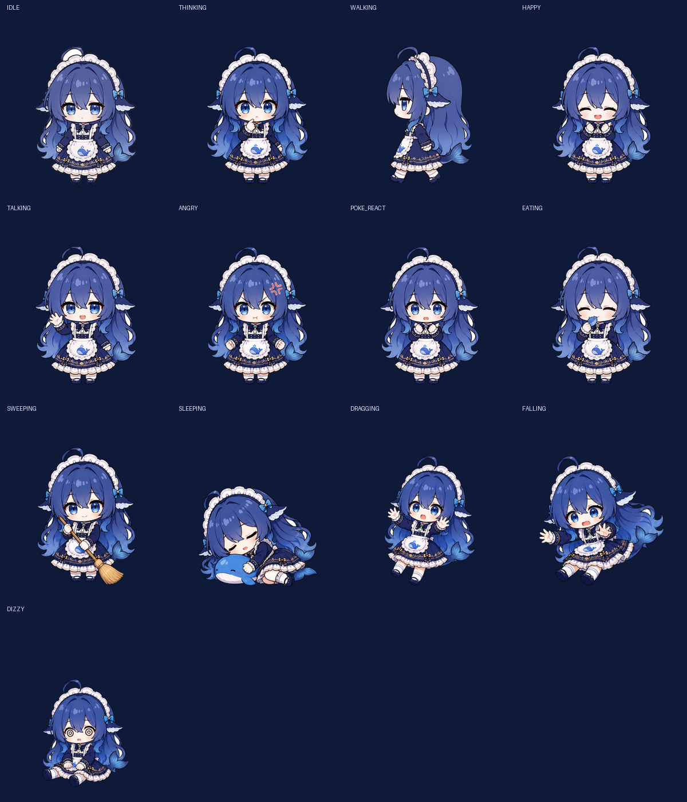
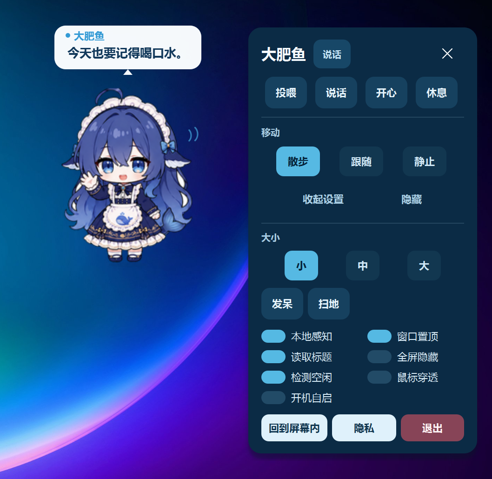

# 大肥鱼桌宠 🐋

一个 Windows 优先、离线优先的轻量桌面宠物。大肥鱼会在桌面散步、回应鼠标互动，并可在完全本地的前提下感知当前应用场景。

[](https://github.com/QCYTSN/ds-local-pet/actions/workflows/test.yml)


<p align="center">
  
</p>

<p align="center">
  
</p>

## 下载

Windows 用户可以直接从 GitHub Releases 下载，无需安装 Python。

[**Latest Release →**](https://github.com/QCYTSN/ds-local-pet/releases)

下载 `.zip` → 解压 → 双击 `DS-Local-Pet-v0.1.0-win-x64.exe` 即可使用。

## 核心特点

- **四帧侧向行走**与多种角色状态 — 散步、发呆、睡觉、开心、生气、眩晕等
- **鼠标互动** — 摸头、戳身体、拖拽甩开、双击投喂
- **本地环境感知** — 可选感知前台窗口类型（编码、文档、视频等），仅读取本地元数据
- **完全离线优先** — 所有台词和逻辑在本地运行，无需联网
- **低资源占用** — 离屏绘制约 0.18 ms/帧，仅占 50 FPS 预算的 0.9%
- **本地人格和台词系统** — 四种人格语气，根据场景和互动给出不同回应

## 界面展示

| 气泡与互动反馈 | 右键快速控制 |
| --- | --- |
|  |  |

## 快速使用

| 操作 | 效果 |
| --- | --- |
| 单击头部 | 开心反馈与台词 |
| 单击身体 | 被戳反馈；连续戳会提高烦躁度 |
| 双击角色 | 打开投喂面板 |
| 按住并拖动 | 进入抓取状态；快速甩开会触发落下与眩晕 |
| 右键角色 | 打开紧凑快速控制面板 |
| 点击托盘图标 | 显示或隐藏桌宠 |

右键面板默认只显示投喂、说话、开心、休息和移动模式；"更多设置"中提供尺寸、本地感知、置顶、全屏隐藏、鼠标穿透、开机自启和隐私入口。

## 隐私说明

启用本地感知后，程序可读取以下低频元数据：

- 前台进程名
- 窗口标题（可关闭）
- 用户空闲时长（可关闭）
- 是否全屏

**不会截图、读取网页正文、读取浏览历史、上传窗口标题或持久化感知记录。** 密码管理器、支付/银行、远程桌面、聊天、邮件和无痕窗口默认不会触发台词；可在 `config.json` 的 `privacy.custom_process_names` 继续补充本地屏蔽名单。

## 从源码运行

适用于 Python 开发者：

```powershell
git clone https://github.com/QCYTSN/ds-local-pet.git
cd ds-local-pet
py -3.11 -m venv .venv
.\.venv\Scripts\python.exe -m pip install -r requirements.txt
```

安装完成后，双击 `启动大肥鱼桌宠.cmd` 即可。它使用 `pythonw` 在后台启动，不会弹出终端窗口；重复启动会唤回已运行的同一只桌宠。

也可以从终端运行：

```powershell
.\.venv\Scripts\python.exe main.py
```

或查看版本：

```powershell
.\.venv\Scripts\python.exe main.py --version
```

## 技术实现

- **Desktop**：Python + PySide6 透明无边框窗口，系统托盘与 Windows 单实例
- **Animation**：manifest 驱动状态机 + PNG 帧动画，优先级中断与自然过渡效果
- **Interaction**：区域命中检测 + 拖拽/抛掷物理
- **Awareness**：Windows 前台窗口元数据，本地分类与隐私过滤
- **Storage**：本地 JSON 配置与状态持久化
- **Privacy**：默认不截图、不录音、不上传桌面信息

深入内容见 [docs/](docs/)。

## 项目结构

```text
app/          启动、单实例与路径管理
animation/    manifest、状态机、帧播放器、过渡与绘制效果
pet/          窗口、渲染、移动、互动与生命状态
awareness/    前台窗口、空闲、全屏和隐私过滤
behavior/     分类、事件去抖、冷却和回应决策
dialogue/     本地台词与人格调度
assets/       运行时图集、动作 manifest、台词和预览
settings/     紧凑控制面板与 JSON 配置
tests/        单元测试和离屏界面回归测试
tools/        素材校验、处理、预览与性能工具
```

## 开发与测试

```powershell
python -m unittest discover -s tests -v
python tools/validate_assets.py
python tools/measure_performance.py
```

当前测试覆盖分类、隐私、去抖、冷却、配置、生命状态、四帧走路、拖拽裁切、气泡以及控制面板展开/收起。性能报告见 [docs/PERFORMANCE_REPORT.md](docs/PERFORMANCE_REPORT.md)。

## Roadmap

- [x] 多状态角色动画（13 个运行时状态）
- [x] 四帧侧向行走
- [x] 鼠标互动与拖拽
- [x] 本地环境感知与隐私过滤
- [ ] 更自然的自主行为（随机事件、AI 驱动选择）
- [ ] 体力与作息系统
- [ ] 更多角色动作和随机事件
- [ ] 声音反馈

## 素材与授权

- 项目代码采用 **MIT License**（见 [LICENSE](LICENSE)）
- 角色视觉资产的授权说明见 [ASSET_LICENSE.md](ASSET_LICENSE.md)
- 上游代码来源见 [CREDITS.md](CREDITS.md)

## 致谢

本项目基于 [1190fasheqi/dafeiyu-pet](https://github.com/1190fasheqi/dafeiyu-pet) 的 MIT 许可桌宠底座进行模块化重构和增量开发。

---

*This is an unofficial fan-made project and is not affiliated with or endorsed by DeepSeek.*